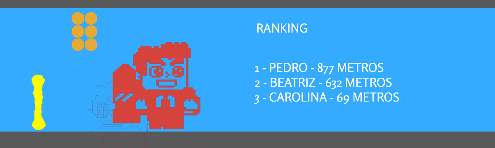
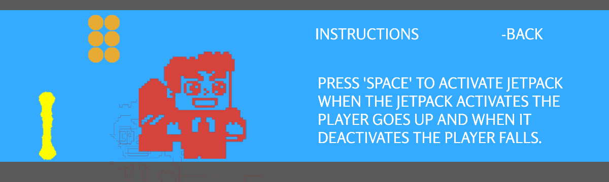
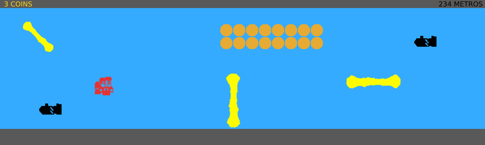
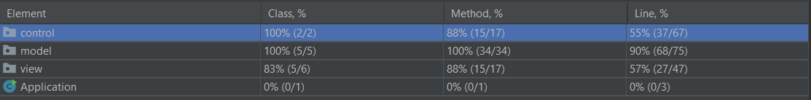
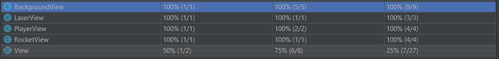

# LDTS_T08_G07 - Jetpack Joyride

## Game Description

This project is based on the popular Android game Jetpack Joyride where the player, who has just stolen a jetpack, needs to escape from a laboratory. To achieve that, the player needs to dodge from obstacles like lasers and missiles. The game has no levels: the objective is to survive the longest distance.

## Implemented Features

- **Player movement**: when the space bar is pressed, the player moves to one unit higher and when there is no input from the user, the player starts to fall
- **Obstacles**: As the game progresses, the obstacles (lasers and missiles) are generated randomly

## Planned Features

- **Coins**: The map will have coins spread through the map that can be caught by the player
- **Menu**: A menu to start the game or to quit
- **Reset**: The player will have a chance to replay the game when it looses
- **Distance and Coins Counter**: There will be a counter to inform the player of the coins it has collected so far and the distance it has travelled

## Mockups:
Main Menu:

Ranking Menu:

Instructions Menu:

Game Running:

Game Over:

## Design

**Problem in context**

Since we are developing a game, we had to think about how to set up the structure and the logic of each component, while keeping in mind the need to make the code modular and easy to reuse. 

**The Pattern**

One common approach to this type of problem is using the Model-View-Controller arquitectural design pattern. By using this pattern, we are able to keep the code modular, easy to reuse and to extend. 

**Implementation**

The usage of the MVC pattern is evident in the structure of the packages, since there are 3 packages: Control, Model and View. The classes in Control are responsible for enforcing the game logic; the ones in Model are just data classes used by the controllers to manage the different objects of the game; the ones in View have the responsability to show the game to the user.

**Consequences:**
- Multiple students can work at the same time on the three main components of the project (model, view and control).
- Code becomes more modular, more readable, easier to extend and reuse. 

**Problem in context**

When running our game, there is the constant need of creating obstacles and these,for the time being, are Lasers and Rockets. By not implementing the factory pattern, if we decide to remove, change or add a different type of obstacle, it will be required to change the bulk of our code, making our program highly unhandy.

**The Pattern**

The factory pattern replaces the direct object construction calls (using the new operator) with calls to a special factory method. This way we can easily change the behaviour of our obstacles (products), as well as, add and remove obstacles, and allows for simpler client code.

**Implementation**

To be implemented.

**Consequences**

- Avoid tight coupling between the creator and the concrete products.
- Make it possible to introduce new types of products into the program without breaking existing client code.

**Problem in context**

The controller class is part of the MVC pattern and is responsible for putting our game together. It acts on both model and view and controls the data flow into model object and updates the view whenever data changes. It also is responsible for keeping the view and the model separate. Since our game should only run once at a time, it shouldn’t be possible to have multiple controller classes.

**The Pattern**

The singleton pattern aims to fix this issue by insuring that a class has only one instance, while providing a global access point to this instance. Making the controller constructor private and creating a static creation method that acts as a constructor solves this problem, because the static method calls the private constructor and every time it is called again, it returns the cached object.

**Implementation**
Implemented on the Controller class (the constructor is private, so the only way to instantiate a controller is through the getInstance method)

**Consequences**

- Only one instance and global access point of the class Controller
- Violates the Single Responsibility Principle. The pattern solves two problems at a time.

**Problem in context**

In our game there is a constant creating and deleting of obstacle objects, Lasers or Rockets. These vary only a little from each other, but by not using an efficient design pattern we take up RAM by each of these objects and most of it ends up being repeated. This results in an inefficient use of memory and can result to crashes if the number of obstacles gets high.

**The Pattern**

The flyweight pattern aims to solve this by storing the extrinsic state, meaning the inconstant data of an object, outside of the object. Instead, this state should be passed to specific methods which rely on it. Only the intrinsic state stays within the object, letting you reuse it in different contexts. As a result, you’d need fewer of the objects since they only differ in the intrinsic state, which has much fewer variations than the extrinsic.

**Implementation**

To be implemented.

**Consequences**

- You have a more efficient use of memory.
- Code becomes much more complicated.

**Problem in context**

By using the MVC pattern, we use a view class to produce the result that the player sees on screen, but because of the amount of objects that need to be drawn, the view class quickly grew into different classes that differ only a little. If no design pattern is used, there will be a lot of repeated methods in these view classes.

**The Pattern**

The Template Method pattern suggests that you break down an algorithm into a series of steps, turn these steps into methods, and put a series of calls to these methods inside a single template method. The steps may either be abstract, or have some default implementation. To use the algorithm, the program provides the different view subclasses, implements all abstract steps, and overrides some of the optional ones if needed (but not the template method itself).

**Implementation**
To be implemented.

**Consequences**

- Removes duplicate code into a superclass
- The program can override only certain parts of the main class, making them less affected by changes that happen to other parts of the algorithm.

### General Structure

## Known Code Smells And Refactoring Suggestions

### Large Class
The Controller class contains many attributes, however, since this is the main class of the game makes sense that the class has all these attributes.

### Parallel Inheritance Hierarchies
Every time there is the need to add a new Element object to the game (if we wanted to add monsters, for instance) we are forced to create a sub class of Element and a sub class of View, but this is needed to keep both the model and the view independent of each other, following the MVC design pattern.

### Duplicate Code
The draw methods of PlayerView, RocketView and LaserView may be considered identical, however, correcting this smell would make the code less obvious and harder to read.

### Data Classes
All the classes of the Model package only have constructors, getters and setters (dumb classes) but this isn't an indication of a problem since we chose to use the MVC architectural pattern which puts the responsibility of handling the game's logic on the Controller class.

### Alternative Classes with different Interfaces
Two classes perform identical functions but have different method names. This code smell can be seen in our project on the element class and obstacle interface, in which their shared attribute (Position) can be same by making the obstacle an extension of the element class.

### Switch statements
The methods of the class Laser are legislated by the orientation of the laser and these to be longer and full of the switch statements, which can be hard to work on the future. This situation asks for polymorphism to simplify new implementations.

### Messages Chains
This code smell happens when methods rely on the other methods of other classes repeatedly. As stated before, if the obstacles were a subclass of element this wouldn't happen because this can fix the need to call numerous methods just to get a position of an element in the game.

## Testing

## Coverage
Global Coverage:

Control Coverage:

Model Coverage:

View Coverage:

### Link to mutation testing report
[Mutation Test](https://github.com/FEUP-LDTS-2021/ldts-project-assignment-g0807/tree/main/build/reports/pitest/202201082341)

## Self-evaluation
André Sousa: 33%
Diogo Rodrigues: 33%
Pedro Fonseca: 33%

