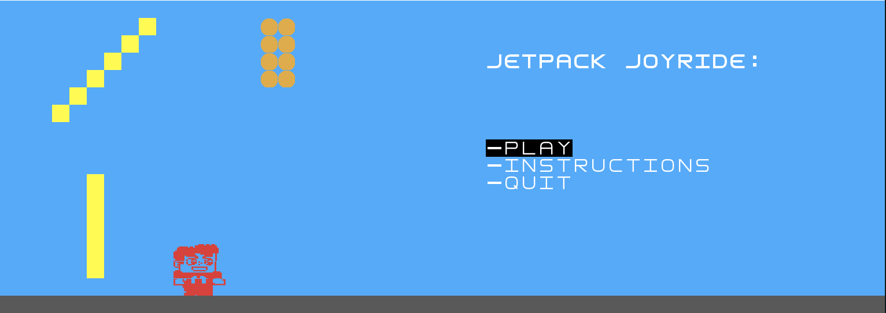
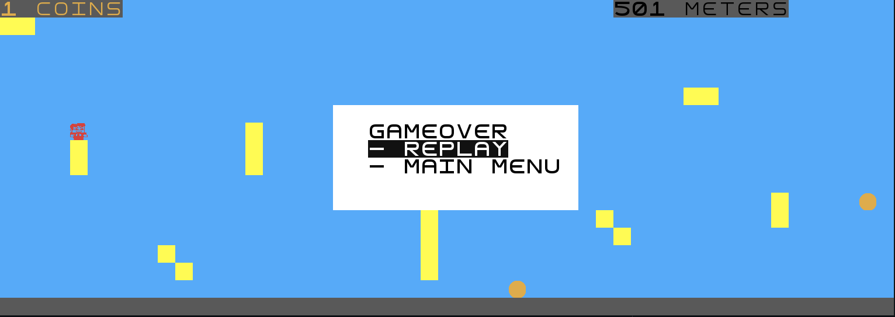
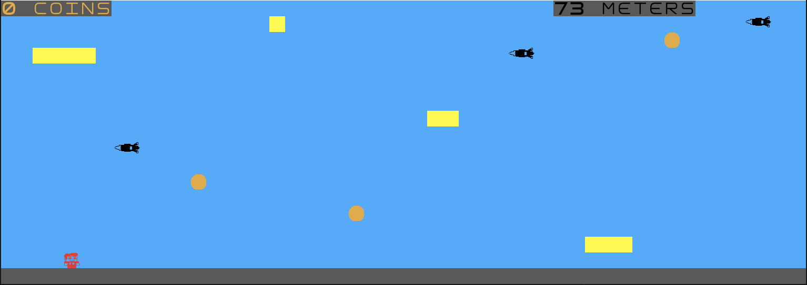

# LDTS_T08_G07 - Jetpack Joyride

## Game Description

This project consists of the popular mobile game Jetpack Joyride. Despite the original being played on a touch screen, this new version requires you to play with your keyboard. The game is a side-scrolling endless runner action video game in which the player must use his jetpack to dodge obstacles, such as, rockets and lasers, as well as, catch coins. The longer you survive the bigger your score.

This project was developed by André Sousa (up202005277@edu.fe.up.pt), Diogo Rodrigues (INSERIR EMAIL) and by Pedro Fonseca (up202008307@fe.up.pt) for LDTS 2021-22.

For a more detailed version of this description click [here](./docs/README.md).

## Images

### Main Menu:

### Instructions:

### Game Over Menu:

### Game running:

