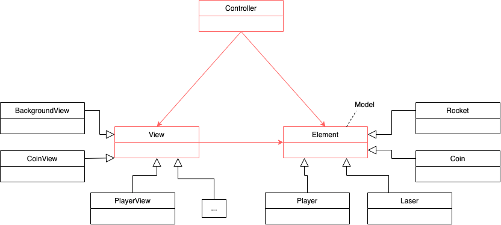
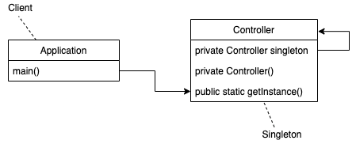
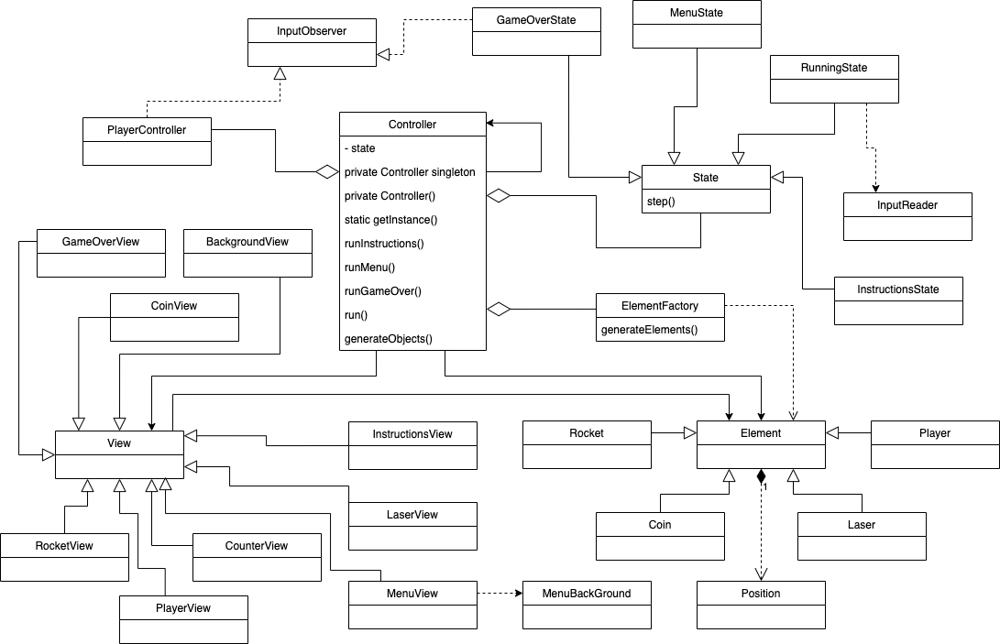
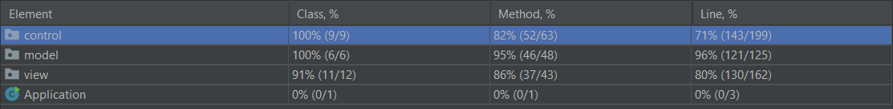
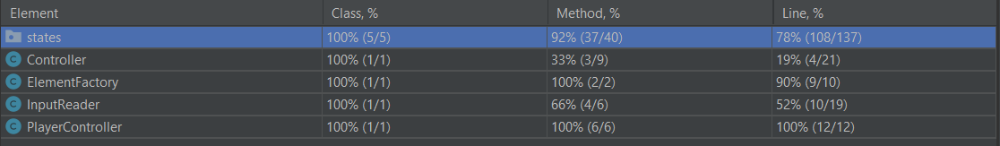
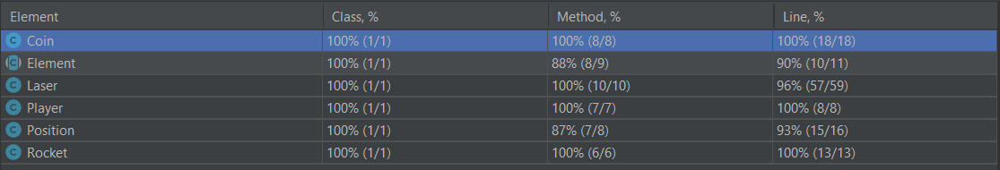
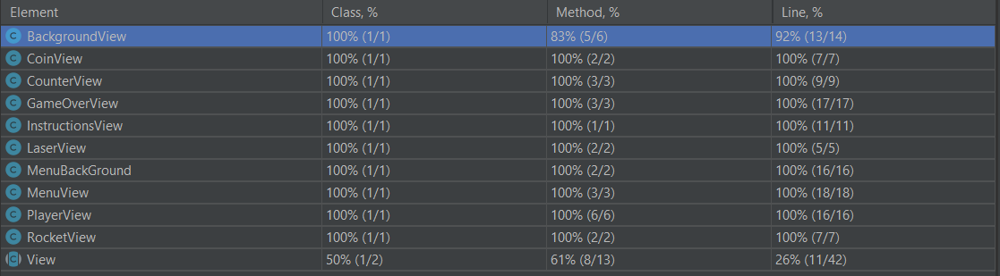

# LDTS_T08_G07 - Jetpack Joyride

## Game Description

This project consists of the popular mobile game Jetpack Joyride. Despite the original being played on a touch screen, this new version requires you to play with your keyboard. The game is a side-scrolling endless runner action video game in which the player must use his jetpack to dodge obstacles, such as, rockets and lasers, as well as, catch coins. The longer you survive the bigger your score.

This project was developed by André Sousa (up202005277@edu.fe.up.pt), Diogo Rodrigues (INSERIR EMAIL) and by Pedro Fonseca (up202008307@edu.fe.up.pt) for LDTS 2021-22.

## Implemented Features

- **Player movement**: While the space bar is begin pressed, the player moves up (one unit at a time) until hitting the upper limit of the screen. Releasing the space bar, the player starts to fall (move down) until the ground is reached.
- **Collision detection**: When playing, the program is constatly checking for collisions between the player and every object, such as, coins and obstacles, and runs the appropriate method depending on the object.
- **Obstacles**: As the game progresses obstacles (lasers and rockets) are generated randomly on the far right of the game screen.
- **Coins**: As the game progresses coins are generated randomly.
- **Counters**: While the game is running, two counters are presented on screen. One contains the distance the player has moved and the other the coins that the player has collected.
- **Main Menu**: When the application starts the Main Menu screen appears and the player is presented with three options: Play - play the game, Instructions - show the instructions, Exit - exit the program.
- **Game Over**: When the program detects a collision between the player and an obstacle, the game stops and the user is presented with the Game Over screen over the previously running game where the user can choose to either replay the game or return to the Main Menu.

## Planned Features

- **Ranking**: Since complexity isn't the main focus of this project, this feature was not implemented because it would not allow to use more design patterns than we already use.
All the remaining planned features were successfully implemented.

## Design

### MVC

**Problem in context**

Since we are developing a game, we had to think about how to set up the structure and the logic of each component, while keeping in mind the need to separate the data, interface and control to be able to reuse the code and make it more organized and easy to implement.

**The Pattern**

One common approach to this type of problem is using the Model-View-Controller arquitectural design pattern. By using this pattern, we are able to keep the code modular, easy to reuse and to extend. 

**Implementation**

The usage of the MVC pattern is evident in the structure of the packages, since there are 3 packages: Control, Model and View. The classes in Control are responsible for enforcing the game logic; the ones in Model are just data classes used by the controllers to manage the different objects of the game; the ones in View have the responsability to show the game to the user.

**Consequences:**
- Multiple students can work at the same time on the three main components of the project (model, view and control).
- Code becomes more modular, more readable, easier to extend and reuse.
- Helps avoid breaking the Single Principle Responsability.

### States

**Problem in context**

**The Pattern**

**Implementation**

**Consequences**

### Creating obstacles

**Problem in context**

When running our game, there is the constant need of creating obstacles and these, for the time being, are Lasers and Rockets. By not implementing the factory pattern, removing, changing or adding a different type of obstacle will require to change the bulk of our code, making our program highly unhandy.

**The Pattern**

The factory pattern replaces the direct object construction calls (using the new operator) with calls to a special factory method. This way we can easily change the behaviour of our obstacles (products), as well as, add and remove obstacles, and allows for simpler client code.

**Implementation**

To be implemented.

**Consequences**

- Avoid tight coupling between the creator and the concrete products.
- Make it possible to introduce new types of products into the program without breaking existing client code.

### Single Controller

**Problem in context**

The controller class is part of the MVC pattern and is responsible for putting the game together. It acts on both model and view and controls the data flow into model object and updates the view whenever data changes. It also is responsible for keeping the view and the model separate. Since our game should only run once at a time, it shouldn’t be possible to have multiple controller classes.

**The Pattern**

The singleton pattern aims to fix this issue by insuring that a class has only one instance, while providing a global access point to this instance. Making the controller constructor private and creating a static creation method that acts as a constructor solves this problem, because the static method calls the private constructor and every time it is called again, it returns the cached object.

**Implementation**

Implemented on the Controller class (the constructor is private, so the only way to instantiate a controller is through the getInstance method)

**Consequences**

- Only one instance and global access point of the class Controller
- Violates the Single Responsibility Principle. The pattern solves two problems at a time.

### General Structure

## Known Code Smells And Refactoring Suggestions

These are the smells we have either not found a solution for or fixing them would result in unreadable code.

### Large Class

The Controller class contains many attributes, however, since this is the class the client it makes sense for the existent of these attributes.

### Parallel Inheritance Hierarchies

Every time a new Element object is added to the game, whether it be an obstacle (monsters) or collectible (power-ups), we are forced to create a subclass of Element and a subclass of View. Even though this is considered a smell, since we are following the MVC architectural pattern, it needs to happen in order to keep the model and the view independent of each other.

### Duplicate Code

The draw methods of PlayerView, RocketView and LaserView may be considered identical, however, correcting this smell would make the code less obvious and harder to read.

### Data Classes

All the classes of the Model package only have constructors, getters and setters (dumb classes) but this isn't an indication of a problem since we chose to use the MVC architectural pattern which puts the responsibility of handling the game's logic on the Controller class.

### Switch statements

The class Laser to exist requires a size and orientation of the laser. To do the orientation, the program is using a random number and switch statements to decide what that number means in terms of orientation. This smell should be ignored though because the switch performs a simple action.

## Testing

### Coverages

#### Global Coverage

#### Control Coverage

#### Model Coverage

#### View Coverage

### Link to mutation testing report

[Mutation Test](https://github.com/FEUP-LDTS-2021/ldts-project-assignment-g0807/tree/main/build/reports/pitest/202201082341)

## Self-evaluation

André Sousa: 33%
Diogo Rodrigues: 33%
Pedro Fonseca: 33%

